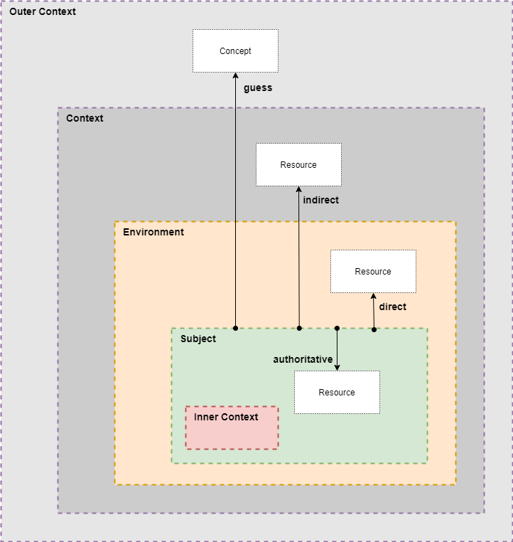

# Subject

- relation `authoritative`
- target: `Resource`
- certainty: `very high`
- dependability: *stable (hopefully)*

## Subject's `Inner Context`

- relation `assumption`
- target: `Concept`
    - type: `Assertion`
    - constraint: `Constraint`
    - dependability: *more or less stable (most of the time)*
- certainty: `high`

---

## Subject's `Environment`

- relation `direct`
- target: `Resource`
- certainty: `very high`

- relation `uncertain`
- target: `Concept`
    - type: `Assertion`
    - constraint: `Constraint`
    - dependability: *more or less stable*
- certainty: `high`

---

## Subject's `Context`

- relation `indirect`
- target: `Resource`
- certainty: `mid`

---

## Subject's `Outer Context`

- relation `guess`
- target: `Concept`
    - type: `Guess`
    - constraint: `Assumption`
    - dependability: *unstable, ad hoc*
- certainty: `low`

---