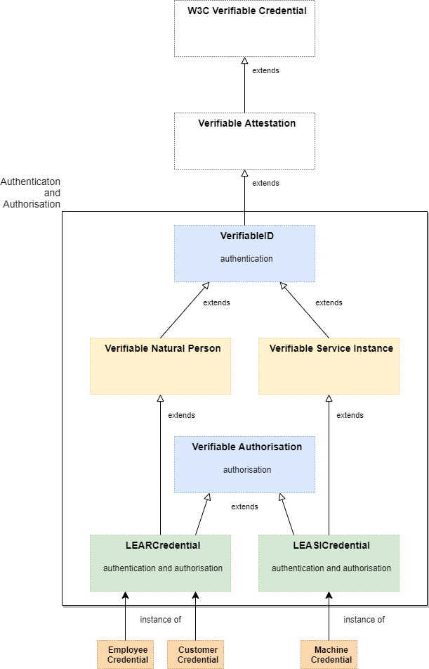

# ELSI version 1 (v1)

- prefix: `elsi`
- uri: "elsi"
- did method `elsi`

## Version 1

*Overview of "elsi v1"*

## Version 2

*Overview of "elsi v2"*

## Protocol

[here](./protocol/).

## Purpose

[here](./purpose/).

---