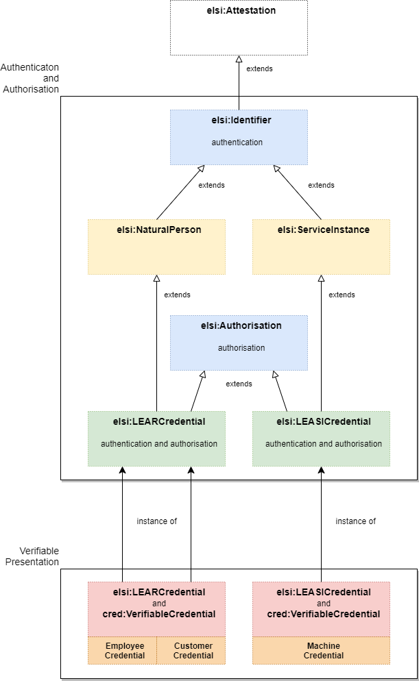

# ELSI

> > > **CAUTION**
>
> - all definitions sometimes are a *little bit underspecified* :-(
> - all specification might contain *bugs*, that will be eliminated in future :-)
> - current status is something like a **draft**
> - ...hopefully being a good starting point
> - so far **NOT** usable for production!
>
> > > **CAUTION**

J. Langkau

---

- prefix: `elsi`
- uri: "https://github.com/nicosResearchAndDevelopment/LDS/blob/main/misc/credentials/elsi/v1/"
- did method `elsi`

## See also

- [Authentication and authorization of entities acting on behalf of legal persons with Verifiable Credentials under eIDAS framework](https://alastria.github.io/did-method-elsi/authn.html).
    - Jesus Ruiz
    - The DOME project participants

- [DID ETSI Legal person Semantic Identifier Method Specification (did:elsi)](https://alastria.github.io/did-method-elsi/)
    - Jesus Ruiz (JesusRuiz)
    - Alejandro Nieto (DigitelTS)
    - Alejandro Alfonso (DigitelTS)
    - Oriol Canades (IN2)
    - Jörg Langkau (nicos AG)

- ["Extending Actor Models in Data Spaces", (2023)](https://www.researchgate.net/publication/370414004_Extending_Actor_Models_in_Data_Spaces)).
    - zum Felde
    - Bellebaum
    - Brost
    - Kollenstraat
    - Dalmolen

## Model

Given model (following version 3 so far) is very aligned to semantics of

- oid
- ETSI-ESI
- eIDAS (certificates)

Expression of given Subject (*Natural Person* (version 1) and  *Service
Instance* (version 2, 3)) the semantics fit to given X.509-subject properties, those are well known, well defined, stable and borrowed from X.500, etc. It drills down the problem of "many cooks have many ingredients", but they are strictly bound (`skos.relation`) to ETSI-ESI/eIADS. 

`oid`: see an example here

- here: ["organizationIdentifier", (http://oid-info.com/cgi-bin/display?oid=2.5.4.97)](http://oid-info.com/cgi-bin/display?oid=2.5.4.97)
- *or*
- here: ["organizationIdentifier", (https://oidref.com/2.5.4.97)](https://oidref.com/2.5.4.97)

All version are based on this. Differences between those are not such big, following the same idea of "given Agent acts on behalf". (See also ["Extending Actor Models in Data Spaces", (2023)](https://www.researchgate.net/publication/370414004_Extending_Actor_Models_in_Data_Spaces)).

Information Model, at this time in `turtle` (`json-ld-@context-thingy` will follow), please click here: [elsi.ttl (Buy it now!!! Fresh version 3!!!)](./elsi.ttl).

## Version 1

Jesus Ruiz, Alastria

- the concept of "Legal Entity Appointed Representative" (as given credential "**LEARCredential
  **") inspired by European Commission's idea of agent *LEAR*.

Picture taken from [Authentication and authorization of entities acting on behalf of legal persons with Verifiable Credentials under eIDAS framework (Jesus Ruiz)](https://alastria.github.io/did-method-elsi/authn.html).

## Version 2

Jörg Langkau, nicos AG

This version ("derived" from Jesus' Ruiz Version 1) introduces:

- layer (yellow) of *Verifiable Natural
  Person* ([ETSI-ESI- and eIDAS-alignment](https://www.etsi.org/deliver/etsi_ts/119600_119699/119612/02.01.01_60/ts_119612v020101p.pdf)) and
  *Verifiable Service Instance*.
- decouples the *Verifiable Authorisation*.
    - ...it makes it `optional` to given credentials **LEARCredential** and **LEASICredential**.
- the concept of "Legal Entity Appointed Service Instance" (**LEASICredential**, spoken: "
  *Lizzy*"), a given Service Instance 'acts on behalf' another agent, a *Legal Entity*.

*Overview of "elsi v2"*

## Version 3

Langkau, nicos AG

This version ("derived" from Version 2) decouples *Verifiable Attestation* from class [*Verifiable
Credential*](https://www.w3.org/TR/vc-data-model-2.0/) (with new naming *Attestation*):

Pros:

- not strictly bound to `cred:VerifiableCredential`
- works "stand alone"
- can be used in other use cases, too!
- maximum flexibility

*Overview of "elsi v3"*

## Version 1, 2 and 3

All do the same (from the perspective of class **LearCredential**).

## Protocol

[here](./protocol/).

## Purpose

[here](./purpose/).

---