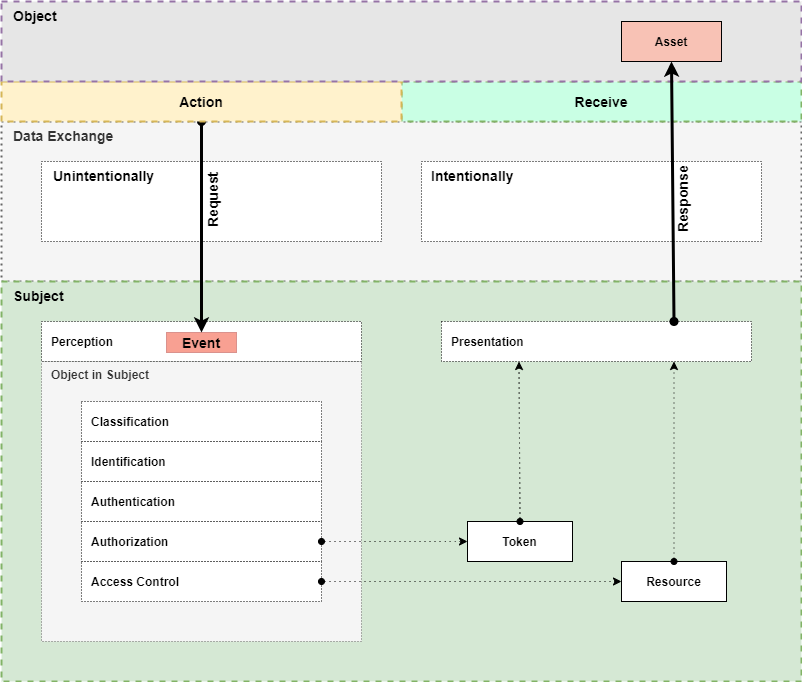

# Interaction

## Introduction

Given Story of "Interaction" is told from **Subject's** perspective.

---

*Overview of "Interaction"*

## Terms

### Data Exchange

Exchange of Data between two Parties.

### Subject

#### Perception

Recognition of *something*.

---

#### Event

Classification of *something*.

---

#### Object in Subject

Subject has the intention of targeting the Object.

- If Subject does not, it will handle given Object as
    - an *anonymous* Entity
    - no further Classification (Object is *classified* as *anonymous*)
    - no further Identification (Object is *identified* as *anonymous*)
    - no further **internal** Authorization (Object is *authorized* as *anonymous*)

- If Subject does not, it will permit Access to requested Resource
    - if given Access Control mechanism allows *anonymous* Objects to do so

---

##### Classification

Classification of Object.

Positive: Object is *classified*.

---

##### Identification

Identification of a *classified* Object.

Positive: Object is *identified*.

---

##### Authentication

Authentication of an *identified* Object.

- **Internal**: like *User and Password*.
- **External**: a verification of given Third-Party-Object-Token
  - *Enrichment*: given *identified* Object is enriched with *external* claims, stating some reliable information given Subject will work with.

Positive: Object is *authenticated*.

---

##### Authorization

Authorization of *authenticated* Object.

- **Requested**: Object will be provided with Authorization-Token.
- **Internal**: detection of Authorization of *authenticated* Object.
    - **Negative**: the *authenticated* Object is **NOT** in active state, like "Account expired", etc.

Positive: Object is *authorized*.

---

##### Access Control

Subject is detecting *authorized* Object's right to Access requested Resource.

Positive: Object is *allowed* to Access requested Resource.

---

### Object

#### Activity

Executed by Object.

#### Request

Made by Object.

### Data Exchange

---