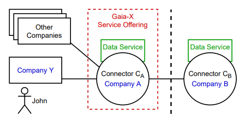
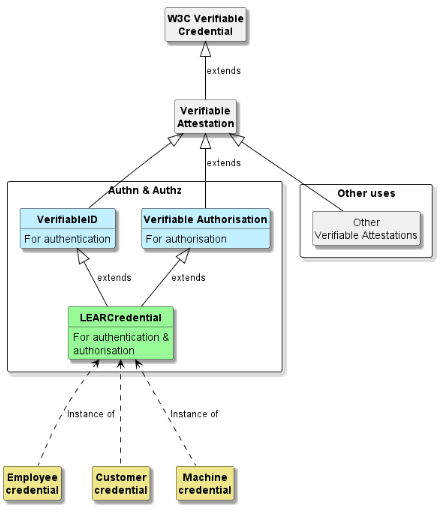

# LDS Identifier, Authorization and Actor Model References

[Back to lds References](../README.md).

## Table of Content

- [**Extending Actor Models in Data Spaces**](#extending-actor-models-in-data-spaces)
- [**Authentication and authorization of entities acting on behalf of legal persons with Verifiable Credentials
  under eIDAS framework**](#authentication-and-authorization-of-entities-acting-on-behalf-of-legal-persons-with-verifiable-credentials-under-eidas-framework)
- [**DID ETSI Legal person Semantic Identifier Method Specification (did:elsi)**](#did-etsi-legal-person-semantic-identifier-method-specification-didelsi)
- [**APRE, The ontology for Appointed Representatives, acting on behalf Legal Entities**](#apre-the-ontology-for-appointed-representatives-acting-on-behalf-legal-entities)

*Table of Content: LDS Identifier, Authorization and Actor Model References*.

---

## Extending Actor Models in Data Spaces

**Hendrik Meyer zum Felde** (Fraunhofer AISEC), **Thomas Bellebaum** (Fraunhofer AISEC), **Gerd Brost** (Fraunhofer
AISEC), **Maarten Kollenstart** (TNO), **Simon Dalmolen** (TNO), April 2023

Origin:
<[https://www.researchgate.net/publication/370414004_Extending_Actor_Models_in_Data_Spaces](https://www.researchgate.net/publication/370414004_Extending_Actor_Models_in_Data_Spaces)>

> **Abstract**
> > In today’s internet almost any party can share sets of data with each other. However, creating frameworks and
> regulated realms for the sharing of data is very complex when multiple parties are involved and complicated
> regulation comes into play. As solution data spaces were introduced to enable participating parties to share data
> among themselves in an organized, regulated and standardized way. However, contract data processors, acting as
> data space participants, are currently unable to execute data requests on behalf of their contract partners. Here
> we show that an on-behalf-of actor model can be easily added to existing data spaces. We demonstrate how this
> extension can be realized using verifable credentials. We provide a sample use case, a detailed sequence diagram
> and discuss necessary architectural adaptations and additions to established protocols. Using the extensions
> explained in this work numerous real life use cases which previously could technically not be realized can now be
> covered. This enables future data spaces to provide more dynamic and complex real world use cases.

Picture taken from original [publication](https://www.researchgate.net/publication/370414004_Extending_Actor_Models_in_Data_Spaces).

*Architecture and context overview of the actor
model extension aimed for with connectors shown in circles and involved companies shown*

---

## Authentication and authorization of entities acting on behalf of legal persons with Verifiable Credentials under eIDAS framework

Jesus Ruiz (Alastria), [The DOME project participants](https://dome-marketplace.eu/), October 2023

Origin:
<[https://alastria.github.io/did-method-elsi/authn.html](https://alastria.github.io/did-method-elsi/authn.html)>

> **Abstract**
> > We describe a mechanism enabling Decentralised Identity and Access Management in B2B ecosystems which require
> high level of legal certainty, reduced manual processes and reduced dependency in third parties for the operation
> of the ecosystem. It combines eIDAS X.509 certificates issued by QTSPs with advanced or qualified signatures and
> seals of Verifiable Credentials.
>  The mechanism enables authentication and access control of entities acting on behalf of a legal person with much
> more descriptive power and flexibility than trying to use just X.509 certificates of representation, and in a
> more efficient and automated way than using just signed PDFs.
>  The mechanism is aligned with the upcoming EDIW (European Digital Identity Wallet) and its supporting eIDAS2
> regulation, but it
> advances the state of the art by focusing entirely on legal persons with an implementation that can be used today
> without the need to wait for future supporting regulation.
>  In particular, we support natural persons acting on behalf of legal entities (e.g., employees or contractors of
> a business), interacting with other legal entities. The mechanism is not recommended for natural persons acting as
> citizens, even if technically the mechanism could be adapted. For citizens we recommend to wait for eIDAS2 and EDIW.
>  (...)

Picture taken from original [publication](https://alastria.github.io/did-method-elsi/authn.html).

*Classes of credentials*

---

## DID ETSI Legal person Semantic Identifier Method Specification (did:elsi)

**Jésus Ruiz** (Alastria), **Alejandro Nieto** (DigitelTS), **Alejandro Alfonso** (DigitelTS), **Oriol Canades** (IN2), **Jörg Langkau** (nicos AG), [The DOME project participants](https://dome-marketplace.eu/), October 2023

Origin:
<[https://alastria.github.io/did-method-elsi/](https://alastria.github.io/did-method-elsi/)>

> **Abstract**
> > This is a DID method for legal persons, bridging the world of the eIDAS regulation with the world of W3C Verifiable
> Credentials, maximising at the same time regulatory compliance, decentralisation and privacy.
>  main use case of the did:elsi method is to enable usage of W3C Verifiable Credentials in processes that require
> high levels of legal certainty, scalability, privacy and eIDAS compliance. It is a good complement to did:web in
> ecosystems like Data Spaces with machine-to-machine interactions, but did:elsi can be used when some processes can
> not use did:web because they require high levels of legal certainty and compliance that can not be achieved with
> did:web (e.g., onboarding, contract signing processes, or in general when presumption of non-repudiation is required).
>  The did:elsi method facilitates the use of JAdES digital signatures with Verifiable Credentials, and so it can be used to meet the requirements of electronic signatures, advanced electronic signatures, qualified electronic signatures, electronic seals, advanced electronic seals, and qualified electronic seals as defined in Regulation (EU) No 910/2014 (eIDAS).
>  (...)

---

## APRE, The ontology for Appointed Representatives, acting on behalf Legal Entities

(Version *1.1*, *1.2*, *1.3*)

**Jésus Ruiz** (Alastria), **Jörg Langkau** (nicos AG), October 2023

Origin:
<[https://github.com/nicosResearchAndDevelopment/APRE/tree/main/v1](https://github.com/nicosResearchAndDevelopment/APRE/tree/main/v1)>

> **Abstract**
> > This document describes the architecture of "Appointed Representatives, acting on behalf of Legal Entities" (**APRE**, as concept) Data Model [APRE-DM].

---

- [Top](#table-of-content).
- [Back to lds References](../README.md).

---